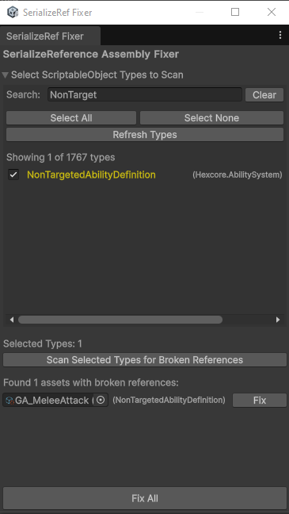

# Unity SerializeReference Assembly Fixer

A Unity Editor tool that fixes broken SerializeReference fields in ScriptableObject assets when classes are moved between Assembly Definitions.

## Problem

When you move classes with `[SerializeReference]` to different assemblies, Unity loses the references and they become null, even though the type information is still stored in the asset's YAML file with outdated assembly names.

## Solution

This tool directly modifies the YAML files to update assembly references, restoring your broken SerializeReference fields without losing data.

## Features

- **Type Selection**: Choose which ScriptableObject types to scan
- **Search & Filter**: Quickly find specific classes
- **YAML Direct Fix**: Updates assembly names in asset files
- **Batch Processing**: Fix multiple assets at once
- **Safe Backups**: Creates .backup files before making changes

## Usage

1. Put  `SerializeReferenceAssemblyFixer.cs` file to any folder named 'Editor' in your project
2. Open `Tools → SerializeReference Fixer`
3. Select the ScriptableObject types to scan
4. Click "Scan Selected Types for Broken References"
5. Click "Fix All" to restore broken references

